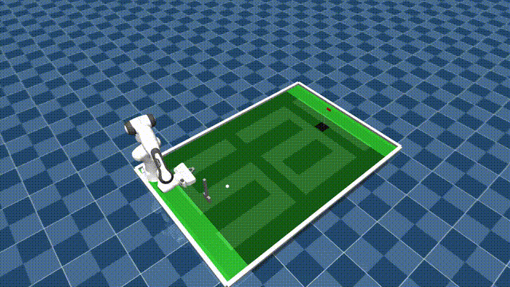

# GolfRL 🏌️‍♂️🤖

This project demonstrates how a **Franka Emika Panda robot arm** can learn to play golf using **Reinforcement Learning (RL)**.  
The task involves grasping a golf club, striking a ball, and guiding it towards a goal using continuous control policies.  

Built with:  
- [Stable-Baselines3 (SB3)](https://github.com/DLR-RM/stable-baselines3)  
- [Gymnasium](https://gymnasium.farama.org/)  
- [SAI](https://competesai.com/) platform for hosted RL environments  
- [MuJoCo](https://mujoco.org/) physics engine  

---

## 🎥 Demo



---

## ⚙️ Setup Instructions

### 1. Clone the Repository
```bash
git clone https://github.com/vasDEV2/GolfRL.git
cd GolfRL
```

### 2. Create the Conda Environment
This repo includes an `environment.yml` file for reproducible setup.

```bash
conda env create -f environment.yml
conda activate franka
```

### 3. Configure SAI Platform
This project uses the **SAI platform** to host simulation environments.

1. Create an account at [sai-rl.org](https://sai-rl.org/).  
2. Obtain your **API key** from the dashboard.  
3. Replace `"YOUR_API_KEY"` in your code with the actual key:

```python
from sai import SAIClient

sai = SAIClient("FrankaIkGolfCourseEnv-v0", api_key="YOUR_API_KEY")
env = sai.make_env(render_mode="rgb_array")
```

---

## 🚀 Usage

### Train an RL Agent
Run the training script:

```bash
python train.py
```

This will:
- Connect to the SAI-hosted Franka golf environment  
- Train an agent using PPO (default SB3 algorithm)  
- Save trained models to `models/`

### Evaluate a Trained Agent
```bash
python evaluate.py --model models/latest_model.zip
```

This runs the trained policy in the environment and prints performance metrics.

### Record Gameplay
You can also record frames or videos:

```python
obs, info = env.reset()
done = False
while not done:
    action, _ = model.predict(obs)
    obs, reward, done, truncated, info = env.step(action)
    frame = env.render(mode="rgb_array")
    # Save frame to video writer if needed
```

---

## 📦 Key Dependencies

- Python 3.12  
- [Stable-Baselines3](https://github.com/DLR-RM/stable-baselines3)  
- [Gymnasium](https://gymnasium.farama.org/)  
- [PyTorch](https://pytorch.org/) with CUDA support  
- [MuJoCo](https://mujoco.org/)  
- [SAI](https://competesai.com/) client libraries (`sai-rl`, `sai-mujoco`, `sai-pygame`)  

---

## 🙌 Acknowledgements
- [Stable-Baselines3](https://github.com/DLR-RM/stable-baselines3)  
- [Gymnasium / Farama Foundation](https://farama.org/)  
- [SAI](https://sai-rl.org/) platform for hosting environments  
- [MuJoCo](https://mujoco.org/) physics engine  
